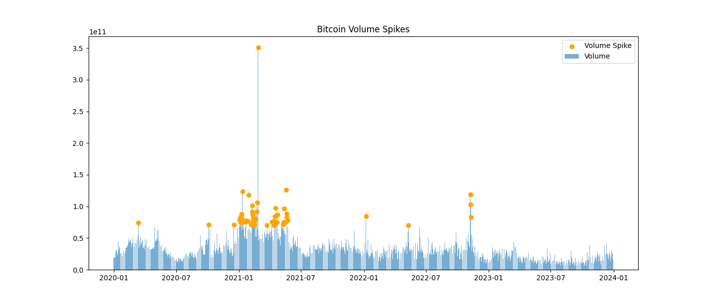
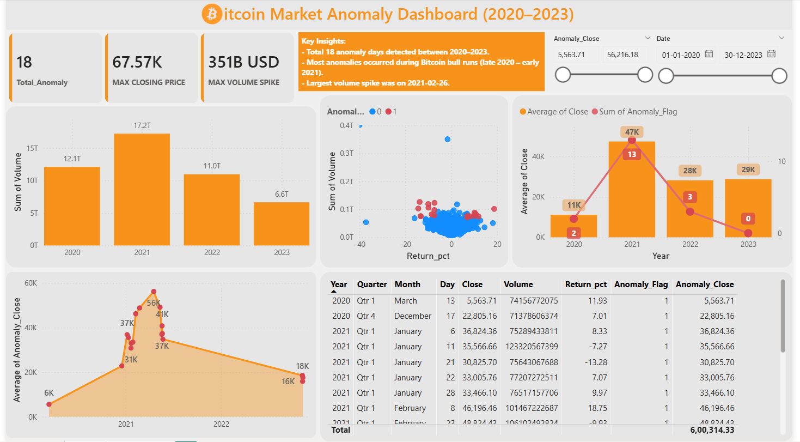

# 🚀 Bitcoin Market Anomaly Detection (2020–2023)

---

## 📝 Overview
This project detects anomalies in **Bitcoin (BTC-USD)** price and trading volume between **2020–2023**.  
It highlights extreme **price crashes, pump-and-dump events, and unusual volume spikes**, using **Python-based anomaly detection** and an **interactive Power BI dashboard**.  

The focus is on identifying **18 anomaly days** where both **sharp price changes** and **volume spikes** occurred together — potential indicators of **market manipulation or major market events**.

---

## 📊 Key Features
- ✅ Detects **volume-price anomalies** using statistical thresholds  
- 📂 Saves anomalies to CSV for reproducibility  
- 📈 Generates anomaly **visual charts** in Jupyter Notebook  
- 🖥️ Builds an **interactive Power BI dashboard** with KPIs and event mapping  
- 📅 Labels anomalies with **real-world market events** (Tesla BTC buy, FTX collapse, China ban, etc.)  

---

## 📈 Example Output
- **Total Anomalies Detected:** 18  
- **Max Closing Price:** $67.6K  
- **Largest Volume Spike:** $351B (May 19, 2021)  

🔎 Note:  
While many days show **only volume anomalies** (unusual trading activity) or **only price anomalies** (sharp moves),  
the **18 flagged days (`Anomaly_Flag = 1`)** are when **both occurred simultaneously**.

---

## 📷 Screenshots

### 🔹 Jupyter Notebook Analysis
  
*Figure 1: BTC price with anomaly points (red dots).*  

  
*Figure 2: BTC volume spikes with anomaly highlights.*  

---

### 🔹 Power BI Dashboard
  
*Figure 3: Interactive dashboard showing anomalies, KPIs, and event labels.*  

---

## 📌 Event Timeline (18 Anomalies)
| Date       | Event Description |
|------------|------------------|
| 2020-03-13 | COVID-19 Panic Crash |
| 2020-12-17 | BTC Breaks 2017 ATH |
| 2021-01-06 | BTC Surge Early 2021 |
| 2021-01-11 | Sharp Correction After Bull Run |
| 2021-01-21 | Post-Surge Dip |
| 2021-01-22 | Quick Bounce |
| 2021-01-28 | Retail-Driven Spike |
| 2021-02-08 | Tesla $1.5B BTC Buy |
| 2021-02-23 | Correction After Tesla Spike |
| 2021-04-18 | Pre-Crash Weakness |
| 2021-05-12 | China Mining Ban Rumors |
| 2021-05-19 | Largest Volume Spike – Panic Selloff |
| 2021-05-20 | Short-Term Rebound |
| 2021-05-21 | Continuation of May Crash |
| 2021-05-23 | Capitulation Bottom |
| 2022-11-08 | FTX Collapse Begins |
| 2022-11-09 | FTX Bankruptcy Fears |
| 2022-11-10 | Short Squeeze Rebound |

---

## 🛠️ Tech Stack
- **Python 3.9+** → Pandas, Numpy, Matplotlib, yfinance  
- **Jupyter Notebook** → Interactive anomaly detection  
- **Power BI** → Visualization, KPI cards, anomaly timeline  

---

## 📜 License
This project is licensed under the **MIT License** – feel free to use and modify with attribution.

---

## 🙋 Author
**Souvik Ghorui**  
📧 Email: ghoruisouvik7@gmail.com  
🔗 LinkedIn: [linkedin.com/in/souvik-ghorui273](https://linkedin.com/in/souvik-ghorui273)  
💻 GitHub: [github.com/Souvik2730](https://github.com/Souvik2730)  

---

## ⚠️ Disclaimer
This project is created **for educational and research purposes only**.  
It is **not financial or investment advice**.  
Cryptocurrency markets are highly volatile — always do your own research before making financial decisions.  

---

## ⭐ How to Support
If you found this project helpful, please **star ⭐ this repository** on GitHub.  
Your support motivates me to create more projects! 🚀

